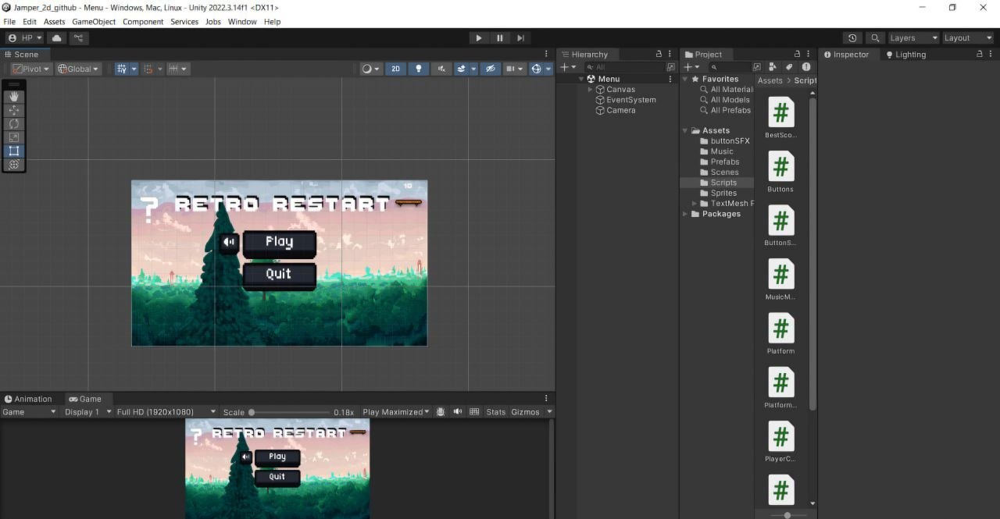

# 🕹️ Retro Restart (Demo Version)

**Retro Restart** is a 2D platformer built with the Unity engine. This repository contains a functional demo version of the game, designed to showcase core game development patterns: procedural generation, jump physics, and UI management.

---

## 🛠️ Technical Info
* **Engine:** Unity 2022.3.14f1
* **Language:** C#
* **License:** MIT

---

## 📋 Core Mechanics in Code
* **PlayerController:** Physics-based jumping using `AddForce` and collision handling.
* **PlatformSpawner:** An algorithm for infinite level generation with increasing difficulty.
* **MusicManager:** Singleton implementation for seamless background music and persistent audio settings.
* **ScoreUI:** Scoring system with high score persistence using `PlayerPrefs`.

---

## 🔗 Links
* 🎮 **Full Version:** [Play on Itch.io](https://1rety1.itch.io/)
* 📢 **Telegram Channel:** [Join Here](https://t.me/RETYGAME) — for project updates and releases without source code access.

---

## 🚀 How to Run
1. Clone the repository.
2. Open the project via **Unity Hub** (Version 2022.3.14f1).
3. Run the `Menu.unity` scene located in the `Scenes` folder.
